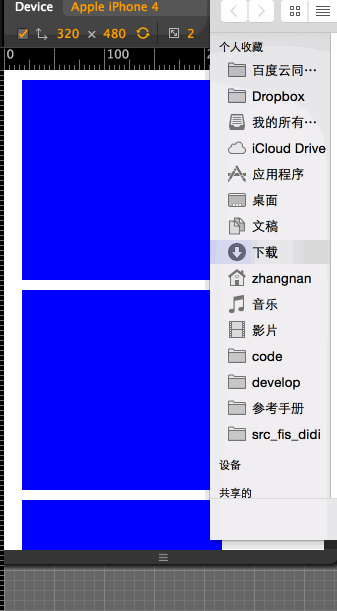

# Imgcliper


## 安装

先安装[fis-didi](https://github.com/webzhangnan/fis-didi)

```bash
#进入项目
cd <project_path>
#也可以 component install webzhangnan/imgcliper 
didi install webzhangnan/imgcliper
```


## Features

- 用户自由拖拽、缩放图片选择合适剪切视口
- 支持图片压缩
- 支持自定义上传图片尺寸
- 兼容 Android 2.0+ 、 iOS 4.0+(3.0未测试	)
- 多实例
- 横竖屏支持
- 多机型测试通过


## Usage

```
var ImgUpload = require('imgcliper');


new ImgUpload( element, {
	//图片上传地址，部分Android浏览器的BlobBuilder有bug，所以通过base64字符上传，需要服务端支持，详见./upload.php
	url: upload_url,
	//post图片数据时保存在`$_POST[${filekey}]`上。
	filekey:'file',
	// 上传的图片尺寸高度单位px
	outputHeight: 500,
	// 上传的图片尺寸宽度单位px
	outputWidth: 800,
	//上传成功回调函数
	onSuccessUpload: function(response){
		response = JSON.parse(response);
		var div = document.createElement('DIV');
		div.innerHTML = response.img ;
		second.appendChild(div);
	},
	// 用户选择文件时调函数
	onFileSelect: function(e, next){
		//继续下一步操作
		/*
		* @isClip Bo0lean
		* 可以传入isClip是否启用裁剪框
		* 举例 `next(false)`则选择文件后跳过裁剪流程，直接上传到服务器
		*/
		next();
	},
	//用户主动取消上传的回调函数
	onCancelUpload: function(){
	},
	//上传失败回调，例如超时
	onFailedUpload: function(){
		
	}
});

```


